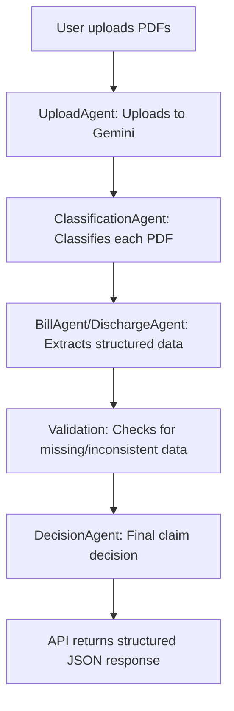

# Claim Document Processor (Mini Engine)

## Overview
This project implements a modular, agentic backend pipeline for processing medical insurance claim documents using AI tools and agent orchestration. Built with FastAPI, it demonstrates how to architect multi-agent workflows for real-world document understanding and decision-making.

## Features
- **Single Endpoint:** `/process-claim` accepts multiple PDF files (e.g., bill, ID card, discharge summary).
- **LLM-based Classification:** Each PDF is classified using a Gemini-powered agent based on content.
- **Text Extraction & Structuring:** Specialized agents (e.g., BillAgent, DischargeAgent) extract and structure relevant data from each document.
- **Validation:** The system checks for missing documents and data inconsistencies.
- **Final Decision:** An AI agent evaluates the structured data and returns a claim decision (approve/reject/pending) with reasons.

## Architecture & Logic



- **UploadAgent:** Handles uploading files to Gemini's Files API and returns file handles.
- **ClassificationAgent:** Uses an LLM prompt to classify each PDF (e.g., bill, discharge summary).
- **BillAgent/DischargeAgent:** For each classified file, runs a prompt to extract structured fields (e.g., hospital name, total amount, patient name, diagnosis).
- **Validation:** Checks for required documents and data consistency.
- **DecisionAgent:** Uses an LLM to evaluate the claim and return a final decision JSON.

## AI Tools Used
- **Gemini (Google GenAI):**
  - File upload and content analysis
  - Document classification
  - Information extraction
  - Final claim decision
- **Prompt Engineering:** Custom prompts for each agent to guide the LLM's output.
- **Cursor, ChatGPT, Claude:** Used for code generation, refactoring, and prompt design during development.

## Example Prompts

### 1. ClassificationAgent Prompt
```
For each PDF document provided, classify it as one of: bill, discharge_summary, id_card. 
Return a JSON array where each element is an object with 'filename' (matching the input display_name) and 'type'. 
Example: [{"filename": "file1.pdf", "type": "bill"}, {"filename": "file2.pdf", "type": "id_card"}]. 
Here are the filenames I provided: ["file1.pdf", "file2.pdf"]. Ensure your output includes all of them. 
If a file cannot be classified into the given types, classify it as 'other'.
```

### 2. BillAgent Prompt
```
Extract the following details from the bill PDF: hospital_name, total_amount, date_of_service. 
Return a JSON object with keys: type (set to 'bill'), hospital_name, total_amount, date_of_service. 
If any field is missing, set its value to null.
```

### 3. DecisionAgent Prompt
```
You are an insurance claim processor.

Given the following structured data about a claim:

{
  "documents": [...],
  "validation": {
    "missing_documents": [...],
    "discrepancies": [...]
  }
}

Evaluate the claim based on:
- Presence of required documents (bill, discharge_summary, etc.)
- Validity and consistency of data (e.g., dates match, no missing fields)

Return a JSON object in this format:
{
  "documents": [...],
  "validation": {
    "missing_documents": [...],
    "discrepancies": [...]
  },
  "claim_decision": {
    "status": "approved" | "rejected" | "pending",
    "reason": "short explanation of the decision"
  }
}

Respond only with the final decision JSON.
```

## How to Run
1. Install dependencies: `pip install -r requirements.txt`
2. Set up your `.env` with the required Gemini API key.
3. Start the server: `uvicorn main:app --reload`
4. Use `/process-claim` endpoint to upload and process claim PDFs.

## Design Choices
- **Agentic Modularity:** Each agent is a separate module, making the system extensible and testable.
- **Async Processing:** Extraction agents run in parallel for speed.
- **LLM-Oriented:** All core logic (classification, extraction, decision) is prompt-driven for flexibility.
- **Security:** Sensitive files (e.g., `.env`, uploads) are excluded from Docker images and version control.

## Requirements
- Python 3.11+
- FastAPI
- Google GenAI (Gemini) SDK
- Uvicorn

---

This project demonstrates real-world AI orchestration for document understanding and decision automation in insurance claims. For questions or improvements, feel free to open an issue or PR! 